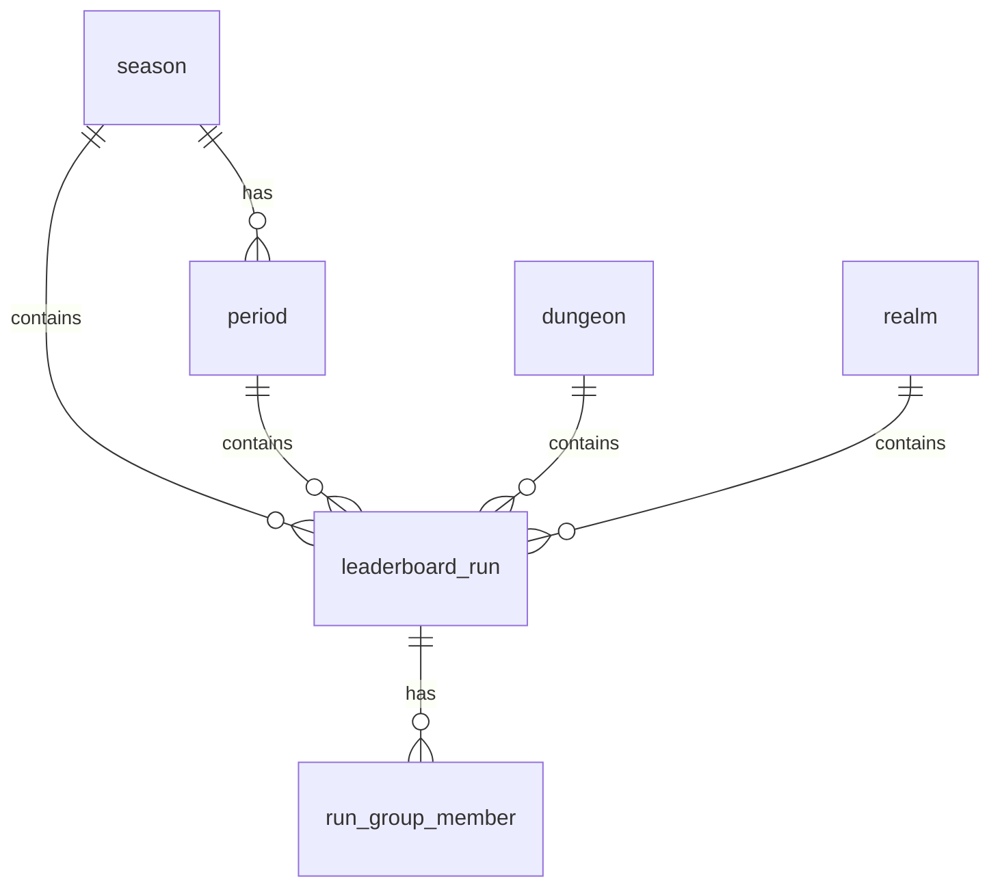

# WoW Leaderboard Database Documentation

## 📋 Table of Contents

1. [Database Overview](#database-overview)
2. [Core Tables](#core-tables)
3. [Table Relationships](#table-relationships)
4. [Materialized Views](#materialized-views)
5. [Indexes and Performance](#indexes-and-performance)
6. [Data Import Process](#data-import-process)
7. [Maintenance Operations](#maintenance-operations)
8. [Query Patterns](#query-patterns)

---

## 🎯 Database Overview

The WoW Leaderboard database stores Mythic+ keystone run data from World of Warcraft across multiple regions, seasons, and periods. It's designed for high-performance querying and supports real-time leaderboard generation.

### Key Features
- **Multi-region support**: US, EU, KR, TW regions
- **Seasonal data**: Organized by WoW seasons and weekly periods
- **Performance optimized**: Materialized views and strategic indexing
- **Scalable**: Designed to handle millions of runs efficiently

---

## 📊 Core Tables

### 1. `season` - Season Information
**Purpose**: Stores WoW Mythic+ season metadata

| Column | Type | Description |
|--------|------|-------------|
| `id` | INTEGER | Primary key, WoW season ID |
| `name` | VARCHAR(64) | Season name (e.g., "Dragonflight Season 1") |
| `start_date` | DATE | Season start date |
| `end_date` | DATE | Season end date |

**Example Data**:
```sql
INSERT INTO season VALUES (6, 'Dragonflight Season 1', '2022-12-13', '2023-05-02');
```

### 2. `period` - Weekly Periods
**Purpose**: Represents weekly periods within a season

| Column | Type | Description |
|--------|------|-------------|
| `id` | INTEGER | Primary key, period ID |
| `season_id` | INTEGER | Foreign key to season.id |
| `start_date` | DATE | Period start date |
| `end_date` | DATE | Period end date |

**Example Data**:
```sql
INSERT INTO period VALUES (824, 6, '2022-12-13', '2022-12-20');
```

### 3. `dungeon` - Dungeon Information
**Purpose**: Stores dungeon metadata

| Column | Type | Description |
|--------|------|-------------|
| `id` | INTEGER | Primary key, dungeon ID |
| `name` | VARCHAR(128) | Dungeon name |

**Example Data**:
```sql
INSERT INTO dungeon VALUES (375, 'Mists of Tirna Scithe');
```

### 4. `realm` - Realm Information
**Purpose**: Stores connected realm data

| Column | Type | Description |
|--------|------|-------------|
| `id` | INTEGER | Primary key, realm ID |
| `name` | VARCHAR(128) | Realm name |
| `region` | VARCHAR(8) | Region code (us, eu, kr, tw) |

**Example Data**:
```sql
INSERT INTO realm VALUES (205, 'Azralon', 'kr');
```

### 5. `leaderboard_run` - Core Run Data
**Purpose**: Stores individual Mythic+ run records

| Column | Type | Description |
|--------|------|-------------|
| `id` | SERIAL | Auto-incrementing primary key |
| `run_guid` | UUID | Unique run identifier |
| `region` | VARCHAR(8) | Region code |
| `season_id` | INTEGER | Foreign key to season.id |
| `period_id` | INTEGER | Foreign key to period.id |
| `dungeon_id` | INTEGER | Foreign key to dungeon.id |
| `realm_id` | INTEGER | Foreign key to realm.id |
| `completed_at` | TIMESTAMP | Run completion timestamp |
| `duration_ms` | INTEGER | Run duration in milliseconds |
| `keystone_level` | INTEGER | Keystone level (e.g., 25) |
| `score` | DOUBLE PRECISION | Mythic+ rating score |
| `rank` | INTEGER | Leaderboard rank |

**Example Data**:
```sql
INSERT INTO leaderboard_run VALUES (
  1, '550e8400-e29b-41d4-a716-446655440000', 'kr', 6, 824, 375, 205,
  '2021-10-16 17:30:47', 1723263, 25, 247.5, 1
);
```

### 6. `run_group_member` - Group Member Data
**Purpose**: Stores individual player data for each run

| Column | Type | Description |
|--------|------|-------------|
| `run_guid` | UUID | Foreign key to leaderboard_run.run_guid |
| `character_name` | VARCHAR(64) | Character name |
| `class_id` | INTEGER | WoW class ID |
| `spec_id` | INTEGER | WoW specialization ID |
| `role` | VARCHAR(16) | Role (tank, healer, dps) |

**Example Data**:
```sql
INSERT INTO run_group_member VALUES (
  '550e8400-e29b-41d4-a716-446655440000', 'PlayerName', 1, 71, 'tank'
);
```

---

## 🔗 Table Relationships

### Foreign Key Relationships



### Relationship Details

1. **season → period** (1:N)
   - One season contains multiple weekly periods
   - `period.season_id` references `season.id`

2. **season → leaderboard_run** (1:N)
   - One season contains multiple runs
   - `leaderboard_run.season_id` references `season.id`

3. **period → leaderboard_run** (1:N)
   - One period contains multiple runs
   - `leaderboard_run.period_id` references `period.id`

4. **dungeon → leaderboard_run** (1:N)
   - One dungeon has multiple runs
   - `leaderboard_run.dungeon_id` references `dungeon.id`

5. **realm → leaderboard_run** (1:N)
   - One realm has multiple runs
   - `leaderboard_run.realm_id` references `realm.id`

6. **leaderboard_run → run_group_member** (1:N)
   - One run has multiple group members (typically 5)
   - `run_group_member.run_guid` references `leaderboard_run.run_guid`

---

## 📈 Materialized Views

### 1. `top_keys_per_group`
**Purpose**: Top 1000 runs per (season, period, dungeon) combination

**Key Features**:
- Ranked by keystone level (DESC), then score (DESC)
- Includes member data as JSON
- Optimized with JOIN instead of subqueries

**Usage**:
```sql
SELECT * FROM top_keys_per_group 
WHERE season_id = 6 AND period_id = 824 AND dungeon_id = 375
ORDER BY rn;
```

### 2. `top_keys_global`
**Purpose**: Top 1000 runs globally per season

**Usage**:
```sql
SELECT * FROM top_keys_global 
WHERE season_id = 6 
ORDER BY rn;
```

### 3. `top_keys_per_period`
**Purpose**: Top 1000 runs per (season, period) combination

**Usage**:
```sql
SELECT * FROM top_keys_per_period 
WHERE season_id = 6 AND period_id = 824 
ORDER BY rn;
```

### 4. `top_keys_per_dungeon`
**Purpose**: Top 1000 runs per (season, dungeon) combination

**Usage**:
```sql
SELECT * FROM top_keys_per_dungeon 
WHERE season_id = 6 AND dungeon_id = 375 
ORDER BY rn;
```

---

## ⚡ Indexes and Performance

### Primary Indexes

1. **`idx_cleanup_leaderboard_runs`**
   - Covers: (season_id, period_id, dungeon_id, keystone_level DESC, score DESC)
   - Includes: (id)
   - Purpose: Efficient cleanup and filtering operations

2. **`idx_leaderboard_run_season_dungeon_keylevel`**
   - Covers: (season_id, dungeon_id, keystone_level DESC, score)
   - Purpose: Dungeon-specific queries

3. **`idx_leaderboard_run_season_period_dungeon_keylevel`**
   - Covers: (season_id, period_id, dungeon_id, keystone_level DESC, score DESC)
   - Purpose: Period-specific queries

### Materialized View Indexes

Each materialized view has:
- **Lookup index**: For efficient filtering
- **Time index**: For time-based queries
- **Unique index**: Required for CONCURRENTLY refresh

---

## 📥 Data Import Process

### Staging Table
```sql
CREATE TABLE run_group_member_staging (
    run_guid uuid,
    character_name varchar(64),
    class_id integer,
    spec_id integer,
    role varchar(16)
);
```

### Import Workflow

1. **Bulk Import Runs**:
   ```sql
   COPY leaderboard_run FROM '/path/to/runs.csv' CSV HEADER;
   ```

2. **Bulk Import Members**:
   ```sql
   COPY run_group_member_staging FROM '/path/to/members.csv' CSV HEADER;
   INSERT INTO run_group_member SELECT * FROM run_group_member_staging;
   ```

3. **Refresh Materialized Views**:
   ```sql
   REFRESH MATERIALIZED VIEW CONCURRENTLY top_keys_per_group;
   REFRESH MATERIALIZED VIEW CONCURRENTLY top_keys_global;
   REFRESH MATERIALIZED VIEW CONCURRENTLY top_keys_per_period;
   REFRESH MATERIALIZED VIEW CONCURRENTLY top_keys_per_dungeon;
   ```

---

## 🔧 Maintenance Operations

### Daily Operations
```sql
-- Monitor index usage
SELECT schemaname, tablename, indexname, idx_scan, idx_tup_read, idx_tup_fetch
FROM pg_stat_user_indexes
ORDER BY idx_scan DESC;
```

### Weekly Operations
```sql
-- Refresh materialized views
REFRESH MATERIALIZED VIEW CONCURRENTLY top_keys_per_group;
REFRESH MATERIALIZED VIEW CONCURRENTLY top_keys_global;
REFRESH MATERIALIZED VIEW CONCURRENTLY top_keys_per_period;
REFRESH MATERIALIZED VIEW CONCURRENTLY top_keys_per_dungeon;

-- Update statistics
ANALYZE leaderboard_run;
ANALYZE run_group_member;
```

### Monthly Operations
```sql
-- Clean up tables
VACUUM ANALYZE leaderboard_run;
VACUUM ANALYZE run_group_member;

-- Check for unused indexes
SELECT schemaname, tablename, indexname, idx_scan
FROM pg_stat_user_indexes
WHERE idx_scan = 0;
```

---

## 🔍 Query Patterns

### Common Query Patterns

1. **Get Top Runs for a Dungeon**:
   ```sql
   SELECT * FROM top_keys_per_group 
   WHERE season_id = 6 AND period_id = 824 AND dungeon_id = 375
   ORDER BY rn LIMIT 100;
   ```

2. **Get Global Top Runs**:
   ```sql
   SELECT * FROM top_keys_global 
   WHERE season_id = 6 
   ORDER BY rn LIMIT 100;
   ```

3. **Get Runs by Region**:
   ```sql
   SELECT * FROM leaderboard_run 
   WHERE region = 'us' AND season_id = 6 
   ORDER BY score DESC LIMIT 100;
   ```

4. **Get Group Composition**:
   ```sql
   SELECT lr.*, rgm.character_name, rgm.class_id, rgm.spec_id, rgm.role
   FROM leaderboard_run lr
   JOIN run_group_member rgm ON lr.run_guid = rgm.run_guid
   WHERE lr.run_guid = '550e8400-e29b-41d4-a716-446655440000';
   ```

5. **Get Season Statistics**:
   ```sql
   SELECT 
     season_id,
     COUNT(*) as total_runs,
     COUNT(DISTINCT dungeon_id) as dungeons_played,
     COUNT(DISTINCT realm_id) as realms_represented,
     AVG(keystone_level) as avg_key_level,
     MAX(keystone_level) as max_key_level
   FROM leaderboard_run 
   WHERE season_id = 6
   GROUP BY season_id;
   ```

---

## 📊 Data Volume Estimates

### Typical Data Sizes
- **Runs per period**: ~50,000-100,000
- **Members per run**: 5
- **Total runs per season**: ~2-4 million
- **Total members per season**: ~10-20 million

### Storage Requirements
- **leaderboard_run**: ~500MB per season
- **run_group_member**: ~2GB per season
- **Materialized views**: ~200MB per season
- **Indexes**: ~300MB per season

---

## 🚀 Performance Optimizations

### Achieved Improvements
- **Materialized view refresh**: 6 minutes → under 1 minute
- **Import performance**: Optimized batch processing
- **Query performance**: Comprehensive indexing strategy
- **Space optimization**: Removed ~2.5GB of unused indexes

### Key Optimizations
1. **Covering indexes** with INCLUDE clauses
2. **Materialized views** for common query patterns
3. **CONCURRENTLY refresh** for zero-downtime updates
4. **Strategic partitioning** by season_id
5. **JSON aggregation** for member data in views

---

## 📝 Notes

- All materialized views support CONCURRENTLY refresh
- The `top_keys_per_group` view uses JOIN instead of subqueries for better performance
- Unique indexes ensure concurrent refresh operations work properly
- The database is optimized for high-performance importing of 30k files with 500 runs each
- Foreign key constraints ensure data integrity across all tables 